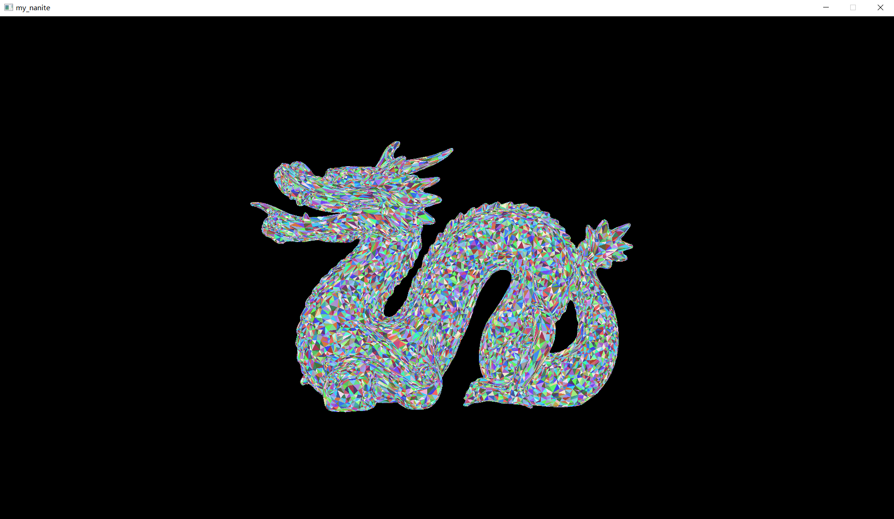
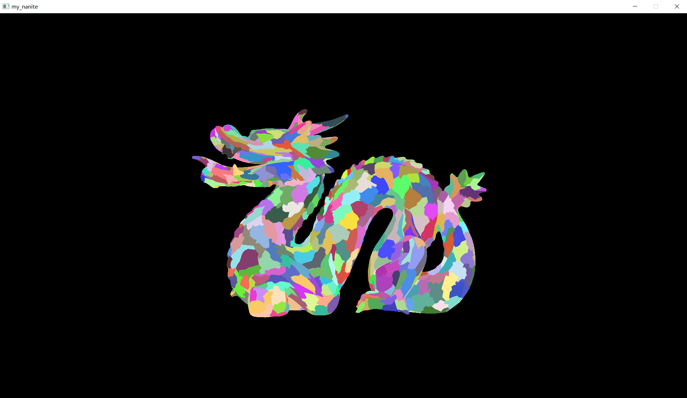
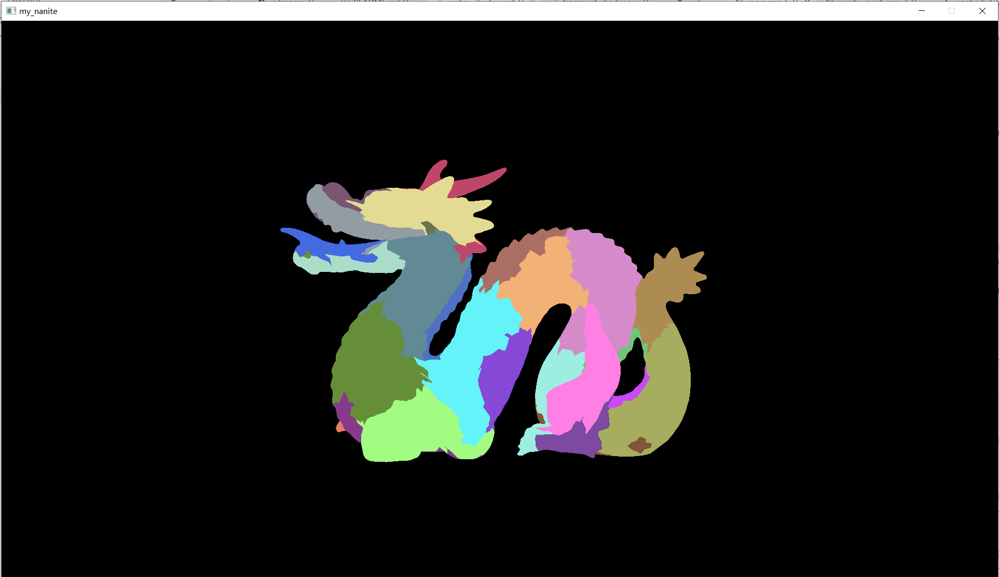

## my_nanite
基于 C++ 和 Vulkan 实现的化简版nanite

- CPU:
    - [x] Mesh化简
    - [x] 将三角面片划分为Cluster
    - [x] 将Cluster分为Group，同时建立Group之间的父子关系（交由Compute Shader统一处理）
    - 并行化
- GPU:
    - [x] compute shader实时计算可见的cluster进行渲染，达到实时LOD
    - [x] 视锥剔除和遮挡剔除
    - BVH

## Result
dragon:
verts: 435545, triangles: 871306
### LOD测试

三角面片:

cluster:

group:

LOD:

avg_fps:1882.489136

### 视锥剔除遮挡剔除测试

LOD & Culling:

avg_fps:1640.190918

## Doing...
在看UE源码的时候，看到UE做剔除时应用到了BVH。要把BVH加到代码中。

## Ref

UE5.0源码

GAMES104（https://games104.boomingtech.com/sc/）

https://github.com/liameitimie/learn-nanite

## Log
目前会出现闪烁，也就是破碎的情况。

想用openmesh开源库进行简化，但寄，这个之后有时间再进行调整。